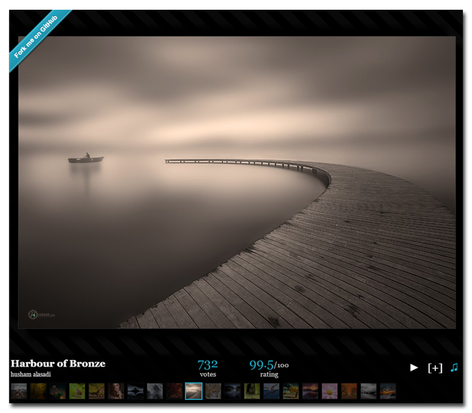

angularjs-500px
===============

A little 500px popular feed viewer using AngularJS.

This small AngularJS app simply loads up 'popular' feed from 500px and displays

Demo
====

The working application can be seen live [here](http://experiments.warpdesign.fr/angularjs-500px)

Why ?
=====

This small application was developped to getting familiar with AngularJS and these wonderful new developement tools:

* Bower
* Grunt
* Yeoman
* Npm

This is a direct rewrite of an old application I wrote using jQuery and CSS3 a few years back: [CSS 3 experiments](http://experiments.warpdesign.fr/500photos/)

Requirements
============

In order to run the application, you will need the following tools (any developer should have these installed but if you're starting with web development you may not have them)

 * Node (see [Node.js](http://nodejs.org/download/))
 * Grunt for task management (install with `npm install -g grunt-cli`)
 * Bower for front dependencies (install with `npm install -g bower`)
 * Yeoman for scaffold (install with `npm install -g yo`)

How to install ?
================

Type `npm install` and `bower install` in a shell to install needed dependencies, then `grunt server` to run the app in development mode and wait for modifications or `grunt build` to build the application.

Since 500px API access needs an API key, you need to create a json file called 'consumer_key.json' with your consumer_key at the root of the project to be able to use the app in development:

`{ "500px": "CONSUMER_KEY" }`

See: [500px applications](http://500px.com/settings/applications?from=developers)